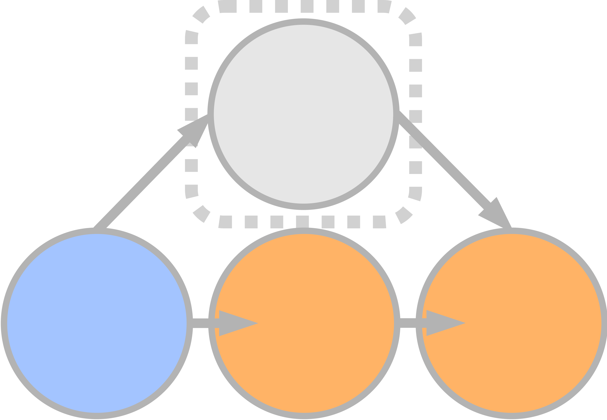

<div align="center">
    
</div>

<h1 align="center">Intent Factored Generation:
Unleashing the Diversity in Your Language Model</h1>

<p align="center">
<a href="https://ifg-llm.github.io/">
        </a>
    <a href= "https://github.com/psf/black">
        </a>
    <a href= "LICENSE">
        </a>
    <a href= "https://arxiv.org/abs/2506.09659">
        </a>
    <a href="https://huggingface.co/datasets/clockwork7/reddit_news_articles_comments">
        </a>

</p>

Welcome to the repository for [Intent Factored Generation:
Unleashing the Diversity in Your Language Model](https://arxiv.org/abs/2506.09659)

This repository contains instructions for replicating the experiments on maths, chatbots and news comment generation detailed in Sections 6.1, 6.3, 6.4 of the paper. We link out to our [fork](https://github.com/EltayebAhmed/ifg_lcb) of LiveCodeBench to replicate code experiments detailed in sections 6.2.

<div align="center">
    
</div>

# The Simple Idea
Although this code base contains a lot of code due to supporting multiple datasets, baselines, evaluation metrics and multiple backends, as well both chat and base models, our method remains very simple. We invite the reader to to look at the [function here](https://github.com/FLAIROx/IFG/blob/2fb4f6f9c8ec479a8bf4e6815f0b0a981b6f2654/unstructured_tasks/inference/rlhf_response_generation_utils.py#L153) which implements the core of our method
# Replicating Experiments
All instructions here assume you run commands from the root directory of the repository.
All code was tested on python3.11.
## Setup
We provide instructions for setting up environment using python pip but we also supply a docker container for those who would prefer it.

### 1. Using pip

To install using pip, clone the repository and set up the python environment as follows
```
>> git clone https://github.com/FLAIROx/IFG
>> cd IFG
>> python3.11 -m venv venv
>> source venv/bin/activate
>> pip install -r requirements.txt
```

### 2. Using Docker
Alternatively, if you have docker compose installed you can use the supplied Docker setup as follows:

### 3. Configure environment variables.
From the root directory of the repository run
```
>> export PYTHONPATH=$(pwd)
```
We use WandB for experiment tracking. To use it you must set you API key as follows
```
>> export WANDB_API_KEY=<your_api_key>
```
Otherwise, you can disable wandb with
```
>> wandb disabled
```
The experiments in Section 6.3 and 6.4 (conversational agents and user comments on news articles) require access to Llama3.1. To run these experiments you must set a huggingface API key with sufficient permissiont to access Llama3.1. This requires agreeing to terms and conditions for Llama3.1 via the huggingface website.

Set the API key as follows
```
>> export HF_TOKEN=<your_api_key>
```

Finally if necessary per your setup, set the available GPUs as follows
```
CUDA_VISIBLE_DEVICES=<available_gpus>
```
## Maths (ArXiv Paper Section 6.1)

These are experiments are run on MATH (Hendrycks et al.). These instruction will assume that you are using GPUs 0-3, so the gpus with the indicies 0,1,2,3. Modify the commands as necessary.

`gllm` is a load balancer for using multiple parallel `vllm` servers.
For experiments in this section you will first need to spin up a `gllm` server, ideally in a separate terminal tab or terminal session. 

To launch a gllm server to use GPUs 0-3 run the following command
```bash
>> gllm start-cluster -w 0 1 2 3 -wp 12000 --port 8181
```


This will start a gllm server with one worker per GPU on gpus 0-3. 
The each worker will use a random port above 12000 and the load balancer (which is OpenAI API compatible) will be accessible at localhost:8181.
Our scripts will use this server behind the scenes.

We then need to set the number of GPUs to 4 (or the number of GPUs you have available if different) by editing `unstructured_tasks/configs/zero_stage_3.yaml` as follows
```
num_processes: <number_of_gpus>
```

To run the experiments to evaluate K vs Pass@K as per Figure 3(a) run the following commands.
```bash
>> python hendrycks_math/experiment_pipelines/sweep_temp_for_multiple_k.py hendrycks_math/configs/k_vs_pass_at_k/qwen-7B-baseline/sweep_config.yaml # baseline
>> python hendrycks_math/experiment_pipelines/sweep_temp_for_multiple_k.py --yaml=hendrycks_math/configs/k_vs_pass_at_k/qwen-7B-ifg/sweep_config.yaml # ifg
```
To run a smaller experiment to verify that everything works correctly you can override some arguments as follows.
```bash
>> python hendrycks_math/experiment_pipelines/sweep_temp_for_multiple_k.py --yaml=hendrycks_math/configs/k_vs_pass_at_k/qwen-7B-ifg/sweep_config.yaml --eval_config.model=Qwen/Qwen2.5-0.5B --num_tuning_problems=32 --num_test_problems=16

```

To replicate the experiments in Figure 3(b) and  finetune model a model on MATH using star run the following command.
```bash
>> ./hendrycks_math/configs/star/baseline_qwen_2.5_7b/sweep_star_math_base.sh # Baselin
>> ./hendrycks_math/configs/star/ifg_qwen_2.5_7b/sweep_star_math_base.sh # IFG
>> # This final configuration launches a small scale toy job, useful for testing setup or debugging .
>> ./hendrycks_math/configs/star/small_debug_run/sweep_star_math_base.sh 
```

All results (checkpoints and scored generations) are written to the `data/` folder in the current directory.

## CodeResults (ArXiv Paper Section 6.2)
Refer to our fork of LiveCodeBench [here](https://github.com/EltayebAhmed/ifg_lcb/).

## Chatbots (ArXiv Paper Section 6.3)
To replicate the experiments from Figure 4(a) do the following
First, set the number of GPUs to the number of available gpus by editing `unstructured_tasks/configs/zero_stage_3.yaml` as follows
```
num_processes: <number_of_gpus>
```
 run the following commands.
```bash
>> ./unstructured_tasks/scripts/RLHF_NEWS_download_data.sh # Download data.
>> ./unstructured_tasks/scripts/RLHF_run_sft_stage_hh_golden.sh # Run SFT stage.
>> ./unstructured_tasks/scripts/RLHF_run_dpo_stage_hh_golden.sh # Run DPO stage.
>> ./unstructured_tasks/scripts/RLHF_generate_response_from_trained_model.sh # Generate responses and score with Relaxed Semantic Entropy.
>> ./unstructured_tasks/scripts/RLHF_train_Qwen7B_reward.sh # Train a reward model for evaluation.
```
All results (checkpoints and scored generations) are written to the `data/` folder in the current directory.

## Diverse Comment Generation (ArXiv Paper Section 6.4)
To produce results similar to Figure 5(a) using Prompted-IFG (not Finetuned-IFG as in the main body of the paper) run the following commands.
```bash
>> ./unstructured_tasks/scripts/RLHF_NEWS_download_data.sh # Download data.
>> ./unstructured_tasks/scripts/NEWS_generate_ifg_comments_reddit.sh # Generate comments and score with Relaxed Sematnic entropy.
```
All results (checkpoints and scored generations) are written to the `data/` folder in the current directory.
